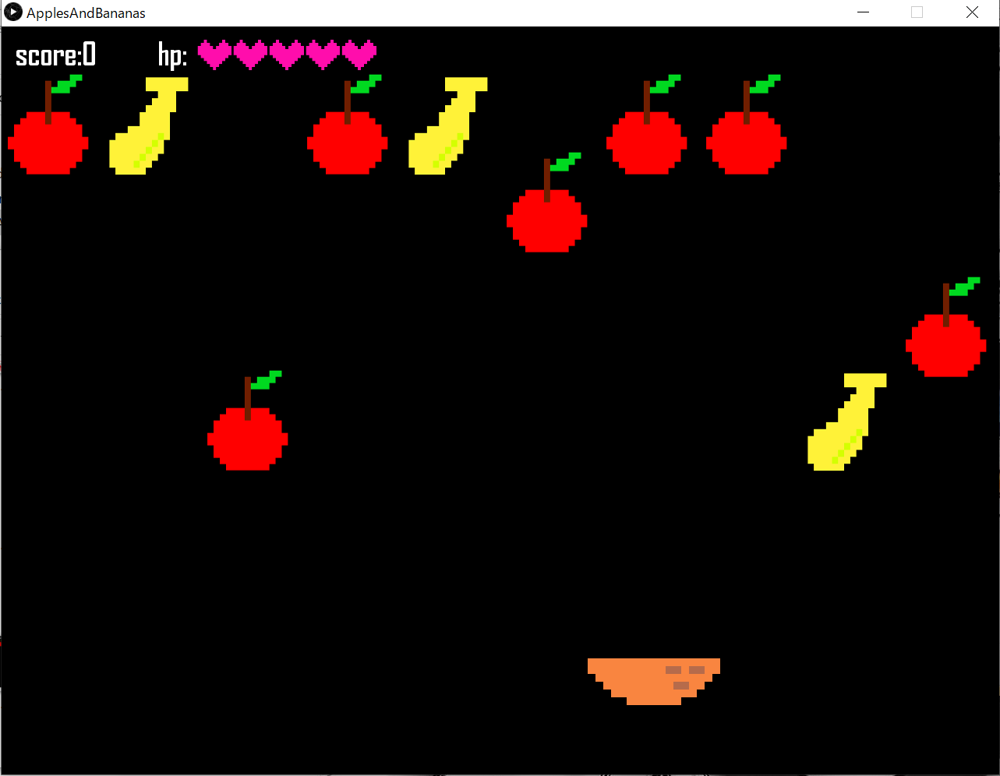

# Apples and Bananas

## 概要
自機となるバスケットのx座標が自分の顔の位置と連動します。顔をうまく動かして、当たるとHPが減ってしまうバナナを避けながら、りんごをキャッチしてScoreを稼ぎましょう！ 
りんごをキャッチするとScoreは+20になり、バナナをキャッチするとHPのハートが1つ減ります。5つあるハートがすべてなくなるとゲームオーバーです。 

## 注意点
PCのスペックによっては遅延が発生する可能性があります。また、背景に物が置いてあると顔認識がうまくいかない可能性があります。 
プレイヤーは1人のみを想定しています。 

## ゲーム画面

 
 
 

## 使用言語/開発環境等
 - Processing 
    - Video
    - OpenCV for processing
 - [ミニドット絵メーカー3](https://neutralx0.net/tools/dot3/)
 - GitHub
 - GitHub Desktop
